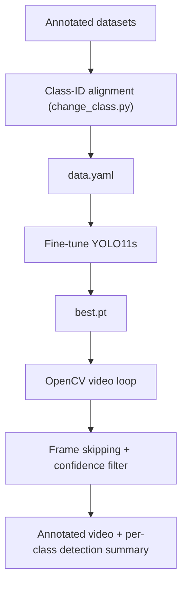

# 🐘🐗🐕 Wildlife Detection: Multi-Class YOLO11 Pipeline

A local, GPU-accelerated object-detection pipeline that detects and classifies **elephants, wild boars, and street dogs** in images and video, using a fine-tuned YOLO11 model and an OpenCV video-inference loop.

> **Topics:** `object-detection` `yolo11` `ultralytics` `opencv` `wildlife` `computer-vision` `pytorch`

---

## Problem
Detect **which animal is present and where** in the frame, for monitoring scenarios where animals are small, distant, partially hidden, or filmed at night.

## Pipeline



## Highlights

**Dataset integrity: class-ID alignment.** When datasets from different sources are merged, class `0` can mean different animals. `change_class.py` re-indexes every label file to one contract:

| ID | Class |
|---|---|
| 0 | elephant |
| 1 | wild boar |
| 2 | dog |

**Training.** Transfer learning from pretrained `yolo11s.pt`: 100 epochs max, `imgsz=640`, batch 16, early-stopping patience 20. Dataset split into train / valid / test.

**Video inference.**
- `cv2.VideoCapture` reads frames; YOLO runs on every 4th frame (`FRAME_SKIP=4`) for throughput.
- On skipped frames, the last detections are redrawn (stored in `last_results`), so the output stays continuous. These boxes are *reused*, not recomputed.
- Confidence threshold `CONF_THRESH=0.35`, a tunable operating point (lower = higher recall, more false positives).
- Live progress: frames/sec and ETA.
- Per-class detection summary.

> **Note on the summary:** counts are *detections across sampled frames*, not the number of animals. One elephant visible for 100 frames contributes many detections.

## My contribution
> **[Confirm and edit]**: dataset class alignment, fine-tuning, and the OpenCV inference pipeline. *Add dataset sources and what you annotated vs. sourced.*

## Results

| Metric | Value |
|---|---|
| Images per class (train / valid / test) | **[ADD]** |
| mAP50 / mAP50-95 (overall) | **[ADD]** |
| Per-class precision / recall | **[ADD]** |
| Inference speed (FPS, GPU model) | **[ADD]** |

## Known challenges
- **Dog vs. wild boar confusion** in darkness, blur, foliage, and distance.
- **False negatives** on small or distant animals.
- **Class balance and visual diversity** (angles, lighting, occlusion) directly affect generalisation.

## Tech stack
Python · Ultralytics YOLO11 · PyTorch · CUDA · OpenCV · YAML

## Repository layout *(adjust to match your files)*
```
├── change_class.py        # label re-indexing
├── train.py               # fine-tuning
├── test_three_models.py   # video inference (consider renaming: infer_video.py)
├── data.yaml
└── README.md
```

## Data & licensing
*State dataset sources/licenses. Don't commit the dataset or weights if redistribution isn't permitted.*
